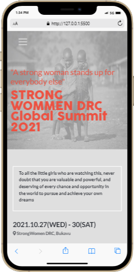
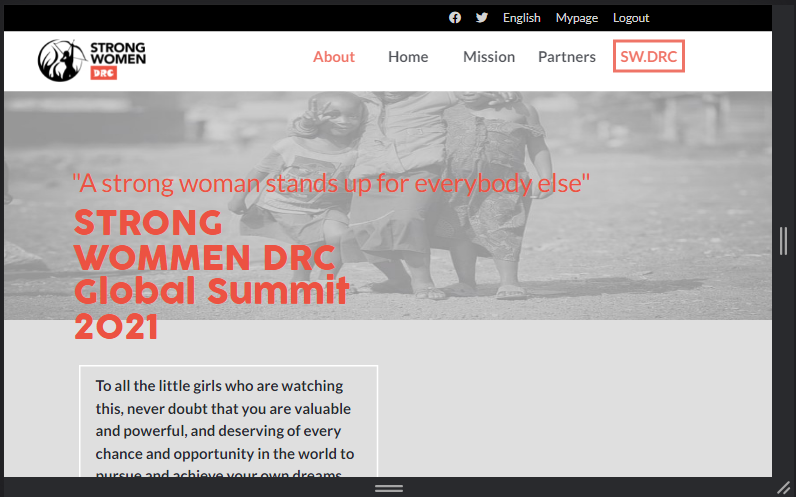

# Capstone Project 1 (SW DRC Conference Page)

>Building a personalized Capstone-project to review the things learned so as to show an understanding and mastery of fundamentals learned.
# Mobile Version

# Desktop Version

## Built With

- Major languages : CSS | HTML | JAVASCRIPT
- Frameworks : Bootstrap
- Technologies used : Git, Github, Linters

## Live Demo

[Live Demo Link](https://rolandm99.github.io/Capstone-Conference-page/)

## Loom Video 

[Documentation video Link](https://www.loom.com/share/d5ed599bfd22478ca4adec1b27b6c181)

## Getting Started

To get a local copy up and running follow these simple example steps

1. First clone the project with the command $ git clone https://github.com/RolandM99/Capstone-Conference_page.git
2. Then open index.html in your browser
3. [optional] You can even fork the project

👤 **Roland Manful Mweze**

- GitHub: [Rolandm99](https://github.com/RolandM99)
- Twitter: [@Manfulmwez](https://twitter.com/ManfulMwez)
- LinkedIn: [Roland N. MWEZE](https://www.linkedin.com/in/roland-n-mweze-8b1045189/)

## 🤝 Contributing

Contributions, issues, and feature requests are welcome!

Feel free to check the [issues page](../../issues/).

## Show your support

Give a ⭐️ if you like this project!

## Acknowledgments

- Inspiration : Original design idea by **Cindy Shin in Behance**

## 📝 License

This project is [MIT](./MIT.md) licensed.
